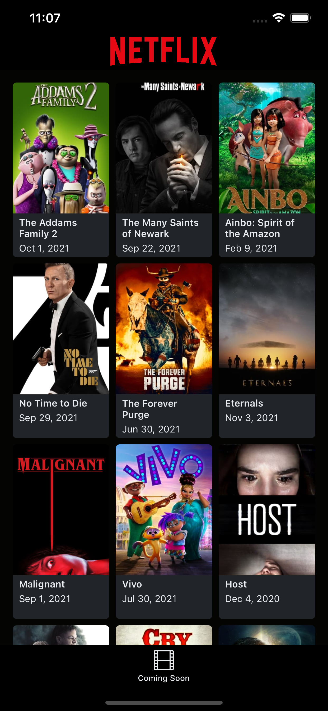

# Flix 

Flix is an app the uses the the [movies database](https://www.themoviedb.org/) to get upcoming movies, with infinite scrolling

    

### Libraries

Flix uses Swift Package Manager (SPM), the project depends on two libraries , which are:

* [Merchant](https://github.com/dubeboy/Merchant)
Merchant uses Alamofire to download json and serialized that JSON into the corresponding swift codable structs

* [SDwebImage](https://github.com/SDWebImage/SDWebImage)
SDWebImage helps us download images and it handles all the caching of that image, which makes it the go to library if you want to efficiently  download images while the user is scrolling in a collection view or tableview.

### Architecture 

We are using MVVM for Presentation + Repository + Coordinators. We don't use any Xibs or Storyboards except on the LaunchScreen. 

The file structure of the architecture is also worth a mention , we went with a file structure that's localised to a feature meaning the architecture is localised to a feature. This way all the files from presentation layer to service and data layer, all are grouped together in one feature folder therefore limiting the scope that one has to look to find all file related to a feature therefore making it easy for newcomers to navigate the code base.

##### MVVM 
  Handles all the events coming from the view and the viewModel has all the logic of what must happen for each event. The ViewModel notifies the view state change via a closure. 
we make sure that when calling functions that have closures we make sure that the closure don't hold a strong reference to the view so that we don't have reference cycles.

##### Repository

The repository simply calls the service for data and if there is any caching and or fetching data from the cache store this should be done here, in this way we dont bloat our viewModel

Repositories have entities, these represent a 1:1 mapping of the data coming back from our server.

##### Coordinators

The app shares one UITabBarController and each tab has its own NavigationController. There is one Abstract Coordinator that Listens to when a view is being pushed or popped, therefore all the navigationControllers of our app set this abstract coordinator as the delegate.

I've all added abit more commenting on the code itself to explain some of my decisions

P.S
The `Infrastructure/Elements/Extensions` folder contains some extensions functions that I find handy and copied this from one of my side projects, (I should make them a library by now )

### Logger

We have a logger that can easily be connected a analytics engine and it doesn't log in production for security reasons and performance, imagine if we are printing huge network requests, the little things make a difference 
### handling constraints in code

we use operator overloading to help us write constraints easily, it looks like this:

`view1 --> view2 // This set the top, bottom, leading, trailing anchor of of view1 to equal view2` 

this will automatically activate the constraints, this does return the created constraint so that if you want to deactivate it at some time in the future you can.

there are many more overloaded operators to help with dealing with constraints in code, checkout `Infrastructure/Elements/Extensions/NSLayoutConstraints+Elements.swift`
